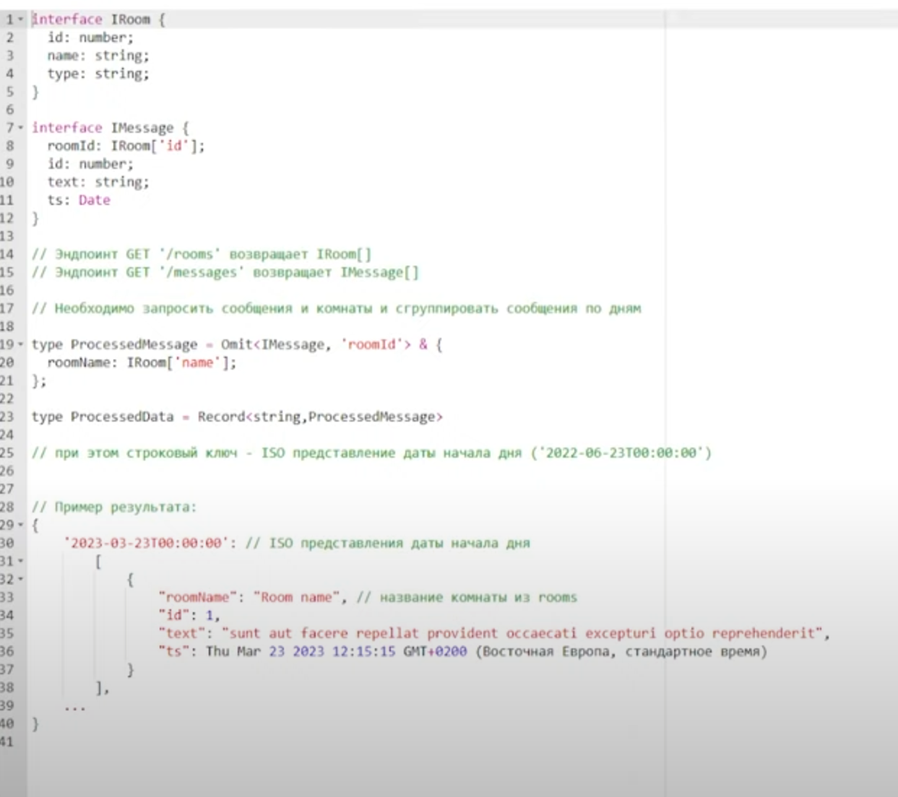
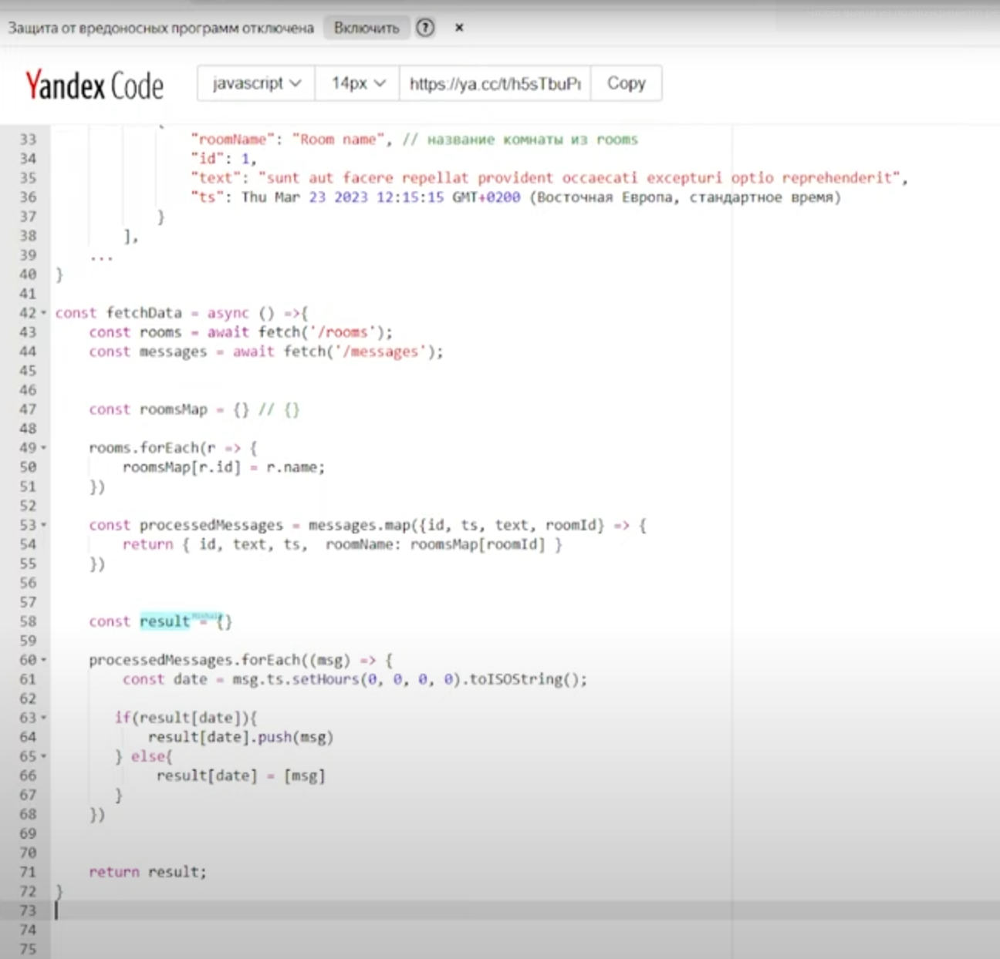

Источник: https://www.youtube.com/watch?v=xANmKpokdVU&t=413s&ab_channel=%D0%9C%D0%B8%D1%88%D0%B0-FrontendDev \
15.01.2025 \
ЗП: До 380к рублей 

Вопросы:
## 1. Какие конфиги ESLint использовал?
Все используют airbnb, использовал дефолтные типа eslint-react-plugin \

## 2. Как рендерится HTML в браузере?
После того как мы получили HTML
1. Парсится HTML код в DOM дерево
2. Загружаются и парсятся CSS стили, формируется CSS дерево
3. Если при парсинге встречается JS, то он может заблокировать дерево. Чтобы избежать можем использовать async/defer (https://learn.javascript.ru/script-async-defer)
4. Потом когда все преобразовалось в HTML дерево и CSS дерево. Формируется неа их основе render3, это дерево объектов рендера. 
5. На основе render3 для каждого элемента рассчитывается положение, ширина, высота. Это этап Layout.
6. Далее происходит отрисовка этой стадии. Этап Painting.
7. Далее стадия Composition. Браузер группирует элементы по слоям, выносит вычисления в отдельный слой чтобы выполнялись на сторону видеокарты.

## 3. Как принудительно вынести элемент на слой?
Что такое «каскадные слои»
CSS свойство `@layer`

## 4. В чем будет разница работы render flow, если будем менять координаты через top left и через transform: translate()
Для анимации рекомендуется использовать transform, потому что он более производителен, потому что при изменении происходит reflow, repaint, recomposition. А при изменнии transform - только recomposition.

## 5. А где производится рассчет (вопрос 4)?
На стороне процессора, а compostion на стороне видеокарты.

## 6. Чем отличается тег img от тега picture?
Тег picture можем подставлять изображения под различные разрешения, в img через srcset. Один из них семантичный тег, другой нет.

## 7. Что знаешь про семантику?
Верстка с помощью определенного набора тегов, чтобы не на div'ах верстали, чтобы было aside, header, span, footer. Это нужно улучшения SEO оптимизации, улучшение accessability, чтобы люди с ограниченными возможностями легче могли пользоваться сайтом, screen reader'ы лучше читали сайты.

## 8. Пользовался препроцессорами CSS?
SCSS, LESS

## 9. Что такое mixin'ы?
Позволяет в CSS создать функцию, пробрасывать аргументы.

## 10. Что такое placeholder селекторы, или silent класс, или класс который управляется через %?
Класс который не попадает в итоговый бандл. Никогда не компилируется в CSS

## 11. Знаешь ли ты отличие директивы import от директивы use в SCSS?
Связано с итоговым бандлом. import забирает все содержимое файла, use забирает только то что нужно

# Typescript
## 12. Какие утилитарные типы можешь назвать в Typescript?
Ответ: Record, Pick, Omit, Required, Partial, ReturnType, Awaited \
Что такое ReturnType? \
Тип который возвращает функция, туда в generic передаем typeof функции.

## 13. Что такое generic?
Можно сказать позволяет гибкие переиспользуемые типы составлять. Определять тип в момент использования, по аналогии с аргументами функции, пробрасываем тип.

## 14. Отличие interface от type?
1. Для type можем задавать alias для любой разновидности типов, и примитивов и объектов. Например type A = 1, через interface мы так сделать не можем. 
2. Interface только для объектов и функций.

interface можем расширять с помощью extends, type - не можем расширять, но можем комбинировать с другим типом с помощью &. \
Если мы напишем 2 interface, то они объединятся, с type с одинаковым именем - вызовут ошибку.

## 15. Что такое абстрактные классы?
1. Нельзя конструировать с помощью `new` и вызывать.
2. Помечаются словом abstract
3. Нужны чтобы от них наследоваться, но создавать их нельзя

## 16. Может ли абстрактный класс нести реализацию какого либо метода конкретного? Или только абстрактные методы иметь?
~~Можно их описывать, но без реализации внутри~~

## 17. Можем ли мы методу абстрактного класса прокинуть generic?
Нет, не может. В Java - может.

## 18. В чем разница между any и unknown? Будет ли разница при сборке?
Разница будет при написании кода, при типе `any` можем вызвать как функцию, обращаться к несуществующим свойствам, даже если это примитив, вызывать как конструктор.\
А если unknown то он не позволит это сделать. Более безопасная версия `any` \
Ответ: Unknown требует уточнения типа, а компилятор при сборке приложения будет проверять unknown, те ты можешь не уточнять этот тип, и обращаться к нему, и во время написания кода ошибок не будет, но на этапе компиляции произойдет проверка типов по AST и если где-то не совпадает, то не соберет приложение. Желательно уточнять тип.

## 19. Что такое наследование?
Возможность класса наследоваться от другого класса, наследовать свойства, методы. В JS есть прототипное наследование, дает возможность наследовать свойства и методы от родительских сущностей.\
Через какое свойство мы наследуем эти вещи?\
Через `__proto__` \
А чем отличается `__proto__` от `prototype`. \
`__proto__` - это ссылка на родительский объект (на его конструктор), а `prototype` - функция конструктор. 

## 20. Чем отличается итерация по ключам объектов forin и Object.keys()?
Object.keys возвращает массив ключей, а forin просто итерируется. \
Например есть суперкласс Human, и есть Person, делаем forin по Person, и Object.keys(Person) \ 
Forin пойдет итерироваться по цепочке прототипов, те хочешь итерироваться по объекту - нужно использовать hasOwnProperty.

## 21. Что такое Promise?
Promise - нужен для выполнения асинхронного кода. Имеет 3 состояния `fullfilled`, `, pending`, `rejected`. Также это функция конструктор, которая принимает функцию экзекьютора - `resolve`, `reject`, имеет методы then, catch, finally. \

## 22. Какие есть методы статичные есть у Promise? 
1. Promise.resolve
2. Promise.reject
3. Promise.any
4. Promise.race
5. Promise.allSettled
6. Promise.all

## 23. Что такое async/await?
Это синтаксический сахар над Promise, асинхронная функция всегда будет возвращать Promise. В ней можем использовать ключевое слово await, указывем перед Promise, чтобы подсказать интерпретатору что нужно ждать до тех пор пока он не выполнится, и после этого переходить к следующей строке кода. Для обработки используем `try, catch, finally`.

## 24. Как можем принудительно отправить функцию в очередь микрозадач?
Есть функция queueMicrostask, MutationObserver.

# React
## 25. Писал ли на классах? Какие сейчас хуки сейчас имплеминтуют методы жизненного цикла в React?
useEffect, useLayoutEffect.\
А какой что делает? \
Привести аналогию с componentDidMount, componentDidCatch \
1. useEffect с пустым массивом зависимостей, аналогия `componentWillMount`, срабатывает после того как отрисовались DOM элементы в браузере.
2. `componentWillUnmount`, если пустой массив зависимостей и мы ему прописываем cleanup функции внутри useEffect, срабатывает при размонтировании.
3. если cleanup функция есть и массив зависимостей не пустой, тогда она будет срабатывать при изменении массива зависимостей со старыми значениями, а потом effect с новыми. Относится к методу `componentWillUpdate`
4. useLayoutEffect - срабатывает когда элементы появились в DOM дереве, но еще не были отрисованы, это метод `component...`. Он срабатывает синхронно, может блокировать рендер.
5. `componentDidCatch` - не можем реализовать на функциях, для ErrorBoundary

## 26. Чем отличаются useImperativeHandle от useRef?
~~useImperativeHandle принимает аргументом ref, и записывает в него данные.~~
А forwardRef что такое?
Нужен для пробрасывания ref'а

## 27. Какие способы принудительного рендера компонентов?
1. Изменить state
2. Динамический ключ
3. В классовых компонентах - forceUpdate 
4. Изменить контекст
5. Ререндер родителя по умолчанию вызывает обновление дочерних компонентов.

## 28. Для чего нужны ключи в React?
React сопоставляет их при reconciliation'е.

S: Что такое reconciliation?  
Алгоритм согласования. Когда сравнивает Virtual DOM с предыдущей версией, на основе этого вычисляется разница между ними. И потом обновляется точечно реальное DOM дерево. Есть эвристический алгоритм O(n) на двух предположениях основано.
> Существует несколько общих решений алгоритмической проблемы трансформации одного дерева в другое за минимальное количество операций. Тем не менее, даже передовые алгоритмы имеют сложность порядка O(n3), где n — это число элементов в дереве.  
> 
> Если бы мы использовали это в React, отображение 1000 элементов потребовало бы порядка миллиарда сравнений. Это слишком дорого. Взамен, React реализует эвристический алгоритм O(n), который основывается на двух утверждениях:
>
> Два элемента с разными типами произведут разные деревья.
> Разработчик может указать какие дочерние элементы останутся стабильными между рендерами с помощью пропа key.
> На практике эти утверждения верны почти во всех случаях.

## 29. Что такое React Fiber?
~~Механизм согласования~~
Нет, это на чем основывается механизм согласования. fiber сидят глубже recoincilation.

## 30. В чем разница если мы в React компоненте будем обращаться к DOM элементу, через documentQuerySelector и менять его и через Ref. В чем разница?
querySelector - менее производителен.  
Сохраняем в ref - ссылку, и через querySelector тоже ссылку.  

S: Верно и там и там ссылка. Мы изменяем элемент через querySelector и через Ref. Как это скажется на рендере?  
Ref - постоянная ссылка, ее можно использовать не только для HTML элементов, храним значение, изменение не триггерит рендер, и сохраняется между рендерами.  
**Через querySelector ты идешь в обход виртуального DOM, при реконсиляции Virtual DOM не будет знать что изменился элемент, он пометит изменившимся и начнет постоянно рендерится, и можно поймать `race condition`. Один работает с механизмами React, другой идет напрямую.** 

# Live-code
## 31. Решить задачу

## 32. Какая сложность была?
Была O(n^2)  
А сейчас O(n)
