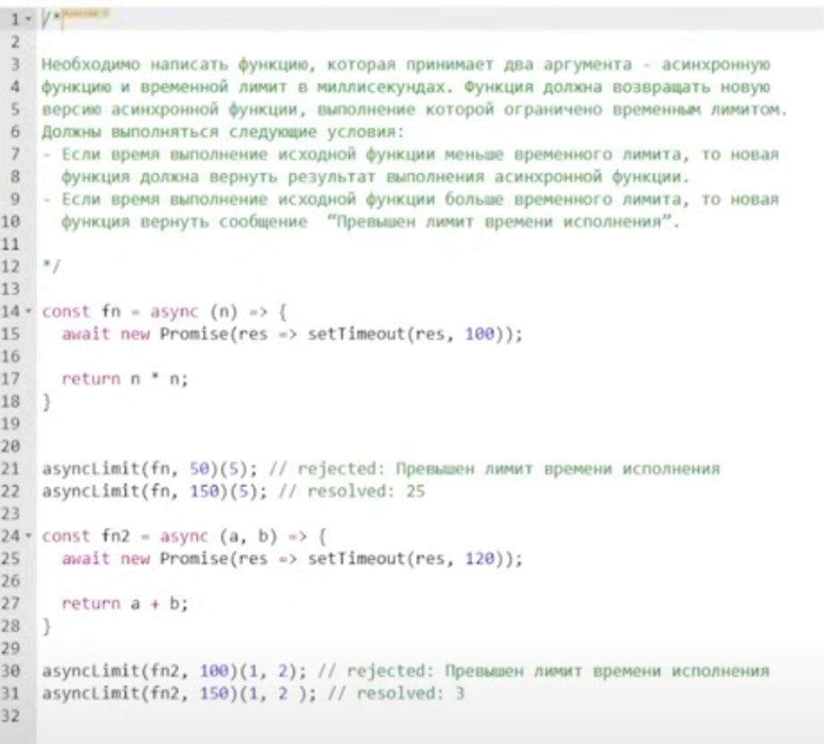
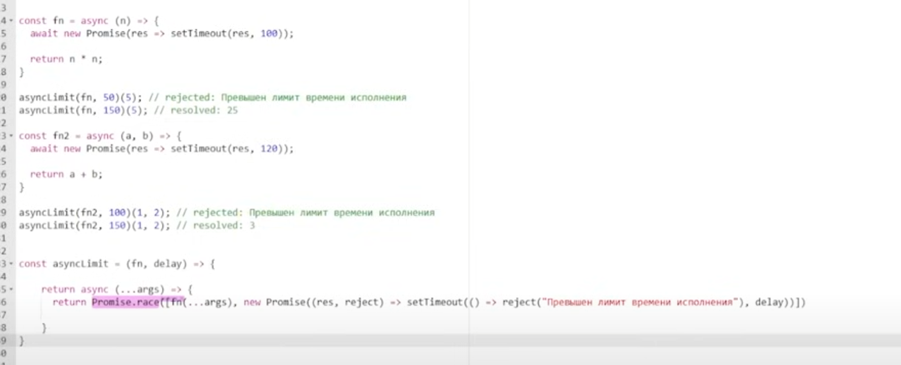
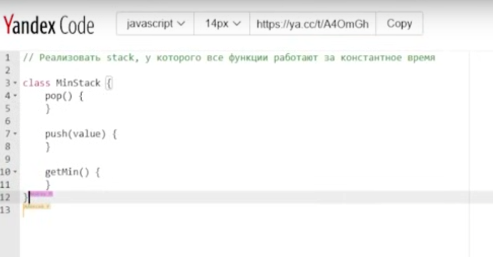
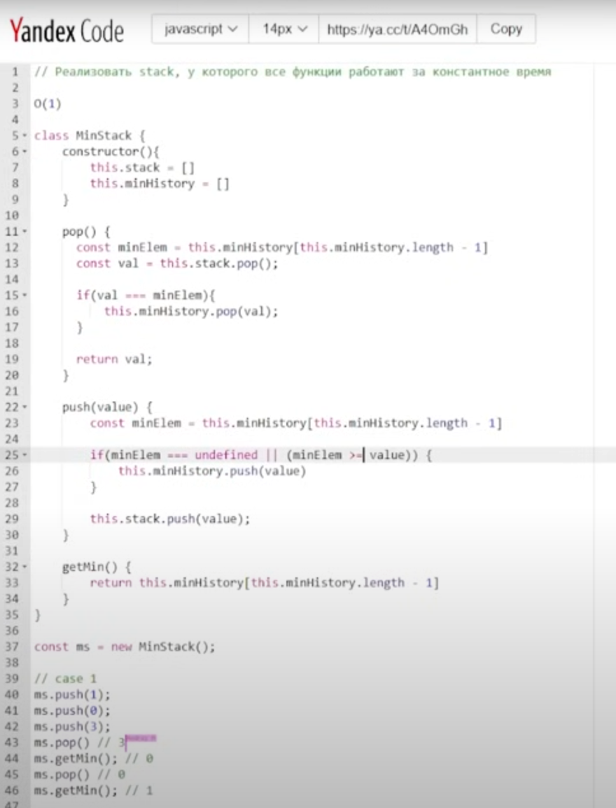

Источник: https://www.youtube.com/watch?v=kOzO4hKTYZA&ab_channel=%D0%9C%D0%B8%D1%88%D0%B0-FrontendDev  
17.01.2025  
ЗП: До 320к рублей

## 1. Есть ли свои проекты?
Делаю PET проекты на незнакомых технологиях.  
Смотрю видосы на ютубе  
Статьи на ютубе

### S: А делаешь для себя или в рамках проекта?  
Если в рамках вакансии указана какая-то технология, то делаю небольшой проект с ее использованием, разбираю ее, пробую.  

## 2. Знаком ли с промисами?
Яндекс код  

## 3. Задача со stack

## 4. Что ты знаешь про Event Loop?
Event loop - бесконечный цикл, в котором выполняется обработчики событий, и браузер распределяет их по очередям: очередь макрозадач, очередь микрозадач.  
Микрозадачи - promises, queueMicrotask, MutationObserver  
Макрозадачи - setTimeout, setInterval, DOM ивенты  
Порядок выполнения задач:
1. Синхронный код 
2. Микрозадачи
3. Потом берется 1 макротаска, выполняется и опять идет по кругу.

Синхронный код попадает в CallStack, выполняется, убирается из CallStack.  
Асинхронный код попадает в WebApi, потом в CallbackQueue, потом в CallStack - после того как CallStack очистится.  
После итерации EventLoop браузер смотрит нужно ли делать рендер после того как CallStack освободится

## 5. Если мы делаем анимацию через RequestAnimationFrame, куда они попадают после макро, микро тасок?
Скорее всего это макрозадача, вероятнее всего она относится к браузерному Api.  
RequestAnimationFrame - синхронизуется с обновлением экрана, те если 60гц монитор, то 60 кадров в секунду. RequestAnimationFrame будет выполняться на каждый кадр.  
Слышал, что RequestAnimationFrame в каждом браузере выполняется по-разному, иногда быстрее чем микрозадачи, иногда в очереди макрозадач.  

### S: А может выполниться раньше чем очистится список микрозадач? В списке есть микрозадача, мы можем выполнить RequestAnimationFrame?
Мне кажется нет, потому что микрозадачи не выполнятся, то дальше EventLoop не будет продвигаться.

### S: Например мы получили макрозадачи, начинаем ее обрабатывать, в процессе обработки когда попадает в CallStack, у нас генерятся новые микрозадачи, что тогда будет?  
Если макрозадача пораждает микрозадачу, тогда выполняется макрозадача, а далее переходит ко всем микрозадачам, и пока не уберет все микрозадачи из очереди, к следующей макротаске не перейдет.

## 6. Что такое функция requestIdleCallback()?
Принимает функцию, которая вызывается в период простоя браузера, когда EventLoop очистится

# Браузер
## 7. Что происходит когда мы вбили адрес в поиске и что происходит с HTML который браузер получает?
1. Сначала получили HTML, на основе его строится DOM дерево
2. Если есть CSS, то подгружаются и строится CSSOM дерево
3. Если есть JS, то подгружаются, есть еще async и defer
   1. Если без всего - то скрипт может блокировать рендер
   2. Если async/defer - то асинхронная подгрузка
4. Построение Render Tree на основе DOM, CSSOM дерева
5. Для каждого элемента Render Three рассчитывается ширина, высота, положение на странице - стадия Layout
6. Для каждого элемента происходит отрисовка - стадия Painting
7. Потом стадия Composition - конечная отрисовка, когда стили группируются по слоям. И выполняются всякие transform, opacity
   1. Composition - единственная стадия которая на стороне видеокарты выполняется.

### S: Для чего Composition слои делает?  
Для оптимизации анимации. 

### S: Чем отличаются async/defer?  
1 отличие  
async не соблюдает порядок загрузки скриптов, какой загрузится - тот и выполнится  
defer соблюдает порядок загрузки скриптов по порядку  
2 отличие  
разное время выполнения, defer выполняется когда DOM дерево построено  

### S: Ссылки на стили блокируют скрипты?  
Стили блокируют скрипты (любые)

## 8. Какие свойства вызывают Repaint? Какие Reflow? 
Reflow вызывается, когда затрагивает ширину, высоту, структуру, положения элемента на странице, position absolute, top, left, right  
Repaint - background color, color, border color  
Минусы этого - нагрузка на процессор будет больше чем при Composition, из-за этого могут быть более медленные анимации. 

## 9. Какие способы хранение информации в браузере?
Session storage, local storage, cookie, indexDB  

### S: Чем отличается Session Storage от Local Storage?  
Local Storage хранит данные на протяжении неопределенного количества времени, после закрытия браузера, после выключения компа.  
Session Storage хранит данные только пока вкладка открыта, когда закрываем, то все очищается.  
И там и там по 5 мб. 

### S: Какие значения можно хранить?
Можно хранить ключ/значения, значения только строковые.

### S: Чем концептуально отличаются cookie от storage?
Размер данных разных, у куки 4кб, у LocalStorage 5мб. Куки отправляются на сервер с каждым запросом, можно конфигурировать всякие `Secure`, `HttpOnly`, `MaxAgeExpires`.

### S: Для чего нужны? `Secure`, `HttpOnly`, `MaxAgeExpires`
https://developer.mozilla.org/en-US/docs/Web/HTTP/Headers/Set-Cookie  
Secure - чтобы кука передавалась только по HTTPS протоколу  
HttpOnly - если true, то не будет доступа из JS к этой куке, чтобы избежать всяких XXS атак.  
MaxAgeExpires - время жизни куки  
SameSite - определяет может ли кука отправляться при кроссдоменном запросе. Чтобы на другой домен нельзя было авторизационную куку отправить. 
Domain - хосты, на которые могут отправляться куки.

### S: Если прописан SameSite и Domain другой указан, отправится ли кука?
Нет, не отправится  

### S: Работал ли с IndexDB?
Нет, но знаю что это асинхронная БД на стороне браузера.

## 10. Как работает CORS политика?
Механизм который с помощью дополнительных http заголовков проверяет, при кроссдоменном запросе, есть ли у нас доступ к этим ресурсам. Чтобы предотвращать доступы с одного сайта на другой, чтобы мошенник не мог запросить данные какого-то другого приложения и вывести у себя на сайте. Контролируется с помощью заголовов, Allow Access, Origin и тд.

## 11. Как браузер проверяет можно ли выполнять запрос?
При передаче кроссдоменного запроса выполняется prefired запрос с методом OPTIONS. Там уже идет проверка. 

## 12. Любой кроссдоменный запрос будет проверяться, или есть какая-то категория запросов, которая не будет проверяться и будет доступна?
Есть ряд заголовков, которые являются простыми, для этих запросов не выполняется проверка. Запросы GET, HEAD, POST без каких-то дополнительных заголовках.

### S: Будет ли у тебя выполняться проверка, если грузится картинка из CDN?
Нет, не будет.

# Уязвимости и безопасности.
## 13. Основные известные уязвимости на ВЕБе, перечислить.
XXS, Man in the middle, CSRF атаки, Click jacking, SQL injection.  

## 14. Как проводится XXS атака?
Внедрение скрипта в приложение. Есть 3 типа: stored, reflected, DOM-based.  
Stored - сохранение скрипта в БД и выполняется уже у пользователей в приложении. 
Reflected - когда ничего не сохраняется, но создается ссылка с вредоносным кодом, и потом по email эта ссылка отправляется пользователю, он нажимает его, потом выполняется этот код, который был в URL. Например из LocalStorage брать какие-то авторизационные данные. Чтобы защищаться нужно применять экранирование. Нежелательно использовать `eval` метод, `dangerouslySetInnerHTML`.   
DOM-based - возможно если нажать F12, то будет видно DOM дерево и туда вставить скрипт, то может что-то отработать. 

## 15. CSRF атаки, чем характерен?
Когда какой-то злоумышленник выполняет запрос от лица клиента, чтобы избежать этого - применяют CSRF токены и нужно HTTPS пользоваться.

### S: CSRF токен, как действует?
На сервере генериуется уникальный токен, для каждого пользовательской сессии, он отправляется вместе с запросом и на бэке валидируется. 

### S: CSRF где храниться?
~~Разумнее его хранить в куки с параметрами Secure, HttpOnly.~~
Лучше чтобы он хранился в SessionStorage, отдельно от куки, чтобы вместе с кукой не могли передавать.

## 16. Clickjacking, как реализуется?
С iframe связано. Скрытые кнопки в iframe. Если не устанавливать x-frame-options-header при http запросах, или не использовать content security policy, то такая штука была возможна.

### S: Content Security Policy - что это?
Политика защиты. Чтобы не из всех источников можно было грузить стили, шрифты и тд. HTTP заголовках выставляется, браузер на них реагирует.

# API.
## 17. Что такое Rest?
REST - API которое строится на HTTP, у него есть ряд ограничений:
1. Отделение клиента от сервера
2. Отсутсвия записи состояния клиента
3. Кешируемость
4. Единство интерфейса
5. Предоставление кода по запросу
6. Многоуровневая система (6 принципов, строится на HTTP запросах GET, POST, PUT, PATCH, DELETE, OPTIONS). 

## 18. Подробнее про методы запросов
GET - получение
DELETE - удаление
PUT - полного обновления ресурса
PATCH - частичного
POST - создание ресурса
OPTIONS - для проверки  
HEAD - типа GET, но не может иметь возвращаемого значения - body
TRACE - связано с установкой соединения

## 19. Сам url ресурс что описывает?
url описывает сам ресурс
Должна быть структура, типа GET /items, POST /items/{id}

## 20. В чем отличие graphQL от REST?
graphQL - единый ендпоинт для всех запрос T, для удаления DELETE - там есть только Queries(получение данных) и Mutations(изменение данных). Можно частично получать данные, описывая в их схеме получения, а в REST по умолчанию возвращается весь объект из БД. 

### S: Можем ли получать связанные сущности из GraphQL? Например посты пользователя?
Да, в схеме описывается users, потом posts и во вложенной структуре можно указать поля, которые можно выцепить.

## 21. Чем отличается протокол HTTP 1.1 от протокола 2?
1. HTTP2 - бинарный, он быстрее обрабатывается, HTTP1 - текстовый.
2. HTTP2 в рамках одного TCP соединения обрабатывать несколько запросов, а в HTTP1 для каждого HTTP запроса нужно устанавливать отдельное TCP соединение, это называется мультипроксирование. 
3. В HTTP2 добавили более оптимизированный алгоритм сжатия header'ов в заголовках.

# Шаблоны проектирования
## 22. Используешь шаблоны проектирования?
Имеется ввиду Singleton, фабрики, прототип, билдер, обсервер, декоратор
Singleton - шаблон, который гарантирует что во всем приложении будет один экземпляр класса и с помощью него можем взаимодействовать, вызывать методы и тд  

### S: Как гарантировать что он один?
Если хотим создать, то в конструкторе нужно проверять, если инстанс класса уже есть, тогда возвращать этот инстанс, если нет, то делать `this.instance = instance`

Decorator - оборачиваем какой-то класс и через декоратор добавляем ему новый функционал или новое поведение.  
Фабрика - пораждающий шаблон, можем создавать подклассы, типа класс для создания других экземпляров класса.

## 23. Solid
S - Single responsibility. Есть класс и он должен выполнять свою задачу, и все сервисы класса должны быть направлены на выполнения этой задачи. Пример: React компонент, и у него задача только отрисовать разметку, то нежелательно чтобы в компоненте были fetch запросы в коде этого компонента. Желательно их выносить в отдельные сервисы, чтобы этот отвечал только за отрисовку.  
O - Open-Closed. Принцип открытости, закрытости. Код должен быть открыт для расширения, но закрыт для модификации. Мы должны обновлять приложение не переписывая старый код.  
L - Метод подстановки Барбары Лисков. Экземляры каких-то классов, должны быть заменяемы на экземпляры их подклассов, чтобы после этого логика приложения не ломалась  
I - Принцип разделения интерфейсов, чтобы классы не зависели от каких-то неиспользуемых методов, т.е. мы не городим 100 методов в одном классе, а разделяем их на подклассы.  
D - Dependency invertion. Модули верхнего уровня не должны зависеть от модулей более низкого уровня. Оба типа модулей должны зависит от абстракции, abstract классов или интерфейсов.   

## 24. Какой шаблон или паттерн используется в React.Context (Provider)?
Когда оборачиваем в Provider. Паттерн Service Locator, из SOLID это буква D. 
