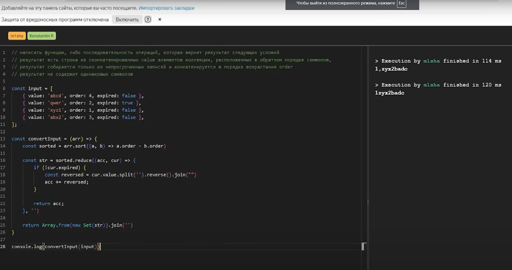
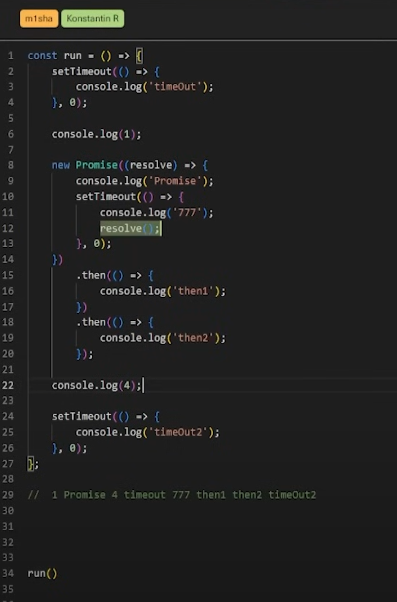

Источник: https://www.youtube.com/watch?v=DEP_9rrIVWk&ab_channel=%D0%9C%D0%B8%D1%88%D0%B0-FrontendDev  
20.01.2025  
ЗП: До 350к рублей

# Задачи

## 1. Мертвая зона JS

## 2. В чем отличие Set, Map, WeakMap?
Set - неиндексированная коллекция для хранения уникальных значений
Map - коллекция для хранения записей вида ключ/значение, в виде ключа может любой вид данных. А в объекте можем только string, symbol, number, остальные приводятся к строкам.
WeakMap - ключи должны быть ссылочного типа, объект или массив или функция, если используем объект в качестве ключа и на этот объект нету ссылок, то он удаляется из памяти сборщиком мусора.

### S: Происходит ли удаление в обычном Map?
Map и Set не исчезают из памяти, WeakMap и WeakSet были придуманы от memory leak problems.

## 3. Какие операторы знаешь?
1. `?.` - chaining, проверяет есть ли свойство в объекте, вернет undefined если не нашло
2. `...` - rest или spread
3. `??` - проверяет есть ли значение слева является null или undefined, то возвращает значение справа
4. `||` - проверяет если значение слева имеет false value, то возвращается справа
5. `&&` - если слева значение true, то присваивается справа
6. ``${foo}`` - литерал строки
7. `structuredClone` - выполняет глубокое копирование объекта
8. `someArray.at()` - принимает индекс и возвращает индекс

## 4. Как осуществляется обход цепочки прототипов?
Сначала идет по цепочке пока не дойдет до Null

## 5. Какая разница прототипа и Object.getPrototypeOf()?
Возвращает объект `__proto__`

## 6. Что такое чистота функции? 
Чистая функция выполняет вычисления на основе своих аргументов, а возвращает значение, которое не имеет побочных эффектов.   
Побочные эффекты - чтение, запись глобальных переменных, манипуляции с DOM деревом, запрос на сервер, мутации входящих аргументов, console.log.  

## 7. Что такое иммутабельность?
Это когда мы создаем копию объекта, а далее работаем с ней.   
Из плюсов: Код становится предсказуемым из-за того что не мутируем начальные данные.  
Из минусов: Чтобы скопировать какую-то структуру, нужно выделять больше памяти.  

## 8. Механизм event loop
Бесконечный цикл...  
Синхронный код сначала попадает в CallStack, выполняется, убирается из стека.  
Асинхронный код попадает сначала в WebApi, потом в CallbackQue, потом попадает в CallStack после того как CallStack очистится  
Все это нужно чтобы приоритизировать задачи, так как JS однопоточный, чтобы когда делается запрос на сервер - не блокировался интерфейс, то event loop для этого и был изобретен.

## 9. Чем вдохновились при создании event loop?
Nginx написана на однопоточности, работает в разы быстрее. Не нужно тратить время и память чтобы согласовывать потоки. 

## 10. Задача event loop

## 11. Какие статические методы промисов знаешь?
Promise.all, Promise.race, Promise.any, Promise.allSettled, Promise.resolve, Promise.reject

# Typescript
## 12. Какие Utility Types знаешь?
Pick, Omit, Return Type, Awaited, Record, ReadOnly, Partial, Required  
1. Pick - это генерик, создать тип, исходный тип, вторым аргументом поля которые нужно перенести в тип  
2. Omit - также, только исключает вторым аргументом поля из типа  
3. Record - структура данных, пример Record<string, string>  
4. Partial - делает поля не обязательными  
5. Required - делает все поля не обязательными  
6. Extract - создают тип, в генерик принимают тип, исключает из Union типа поля
7. Exclude - 

## 13. В чем разница any и unknown?
any - польностью отключает типизацию, если объявили примитив то сможем обращаться к несуществующим методам, свойствам  
unknown - более безопасен 

## 14. Что такое TypeGuards?
Функции принимают переменные или аргумент и позволяет сузить или определить тип этой переменной, внутри TypeGuard можем использовать typeof, instanseof, оператор in чтобы проверить наличие свойства в объекте.   
Когда создаем TypeGuard в ReturnType указываем, например, аргумент называется Object, и в ReturnType указываем Object is string или Object is number

## 15. Зачем нужен any?
Он придуман для обратной совместимости, например была библиотека написана на JS, и ее разработчики не переписали под TS ее

## 16. Задача на типизацию

# React
## 17. Какие способы хранения состояния знаешь?
Context, useState (useReducer), useRef, State Managers

## 18. Что такое useEffect, useLayoutEffect?
useEffect - хук для выполнения побочных эффектов в функциональных компонентах, типа запрос на сервер, манипуляции с DOM деревом, подписка на веб сокеты. Выполняется асинхронно, после того как компоненты отрисовались в браузере. 1ый параметр - коллбек с эффектом, 2ой параметр - массив зависимостей.  
Если оставить пустым, то только при первом рендере, если не передевать массив, то будет при каждом рендере выполняться. Если поставить в массив зависимостей, то будет тригериться при изменении зависимостей.  
Можно использовать cleanup функцию, из callback функции, он выполняется при размонтировании и изменении массива зависимостей.  

useLayoutEffect - выполняется синхронно, до отрисовки компонентов, после того как появились в DOM дереве и можно блокировать рендер. 

### S: Для чего useLayoutEffect нужен?
Например для измерения размеров каких-то DOM элементов, или обновить state без мерцания, до отрисовки

## 19. Что вызывает render в React компонентах?
Render вызывает изменение стейта, контекста, ключей, пропсы (если используешь state менеджеры). Когда key меняется, компонент размонтируется и монтируется заново.  
forceUpdate - в классовых компонентах, в функциональных можно свой написать.

## 20. Задача - task5.tsx

## 21. Задача - task6.tsx

## 22. Задача - task7.tsx 

## 23. Есть метод жизненного цикла shoudComponentUpdate, можно ли его реализовать в функциональных компонентах?
Можно, React.memo(_, () => {}), второй аргумент для сравнения пропсов

## 24. Что расскажешь про useRef?
Позволяет сохранять значения, ссылки на DOM элементы, чтобы взаимодействовать с ним.  
Из особенностей, это мутабельный объект и мутирование свойства current не вызывает повторного ререндера, те это один и тот же объект при ререндере. 

### S: Почему мы храним ссылки на DOM в useRef?
---

### S: Как прокинуть ref в другой компонент?
Через forwardRef

## 25. Что такое Virtual DOM?
Легковесная копия DOM дерева, которая в оперативной памяти сохраняется, и она хранится в виде JS объекта.  
Благодаря тому что хранится в виде объекта - позволяет манипулировать с этим объектом и изменять его, не затрагивая реальное DOM дерево, пока это не понадобится.  
Точечно обновлять элементы в которые изменились в реальном DOM дереве.  
Сначала изменяется state, далее изменяется Virtual DOM, сравнивается текущая версия Virtual DOM с предыдущим, вычисляется разница между двумя деревьями.  
Потом точечно пакетно обновляется реальный DOM.   
React использует эвристический алгоритм, на 2 предположениях основаны:
1. 2 элемента с разными типами произведут разные деревья
2. можно использовать ключи

### S: Есть ли определения у этих изменений?
Rerender,

### S: Как называется механизм сравнения текущего DOM с предыдущим?
Reconcilation

## 26. Зачем использовать эвристический алгоритм?
Изначально был алгоритм который проходил по всему дереву, и была сложность O(n^3), а этот алгоритм позволяет O(n).  

### S: Как получилось O(n)?
Происходит сравнение двух корневых элементов, дальше сравнение не идет. Уничтожается старое дерево, вызывается ренедер нового дерево.

### S: Для чего был придуман Virtual DOM?
Для оптимизации рендеринга и ускорения работы

## 27. Зачем нужны keys в React?
key - атрибут для создания списков из элементов массива, он позволяет React определить какие элементы изменились, добавились, удалились. Должен быть уникальным. Если удаляется и мы используем индекс, то будут проблемы со state.  
Если статичный массив, то можем использовать индексы.  

